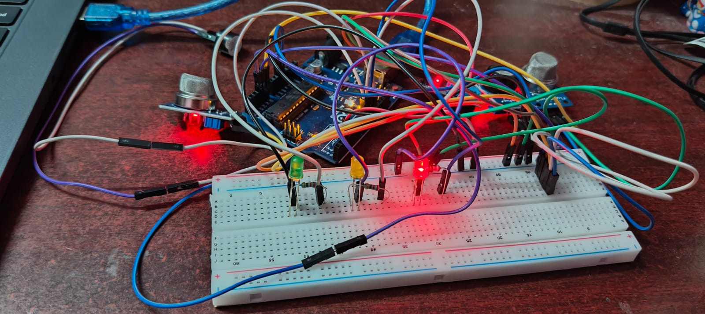
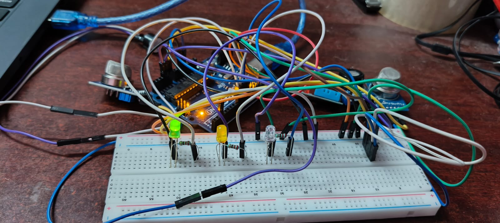
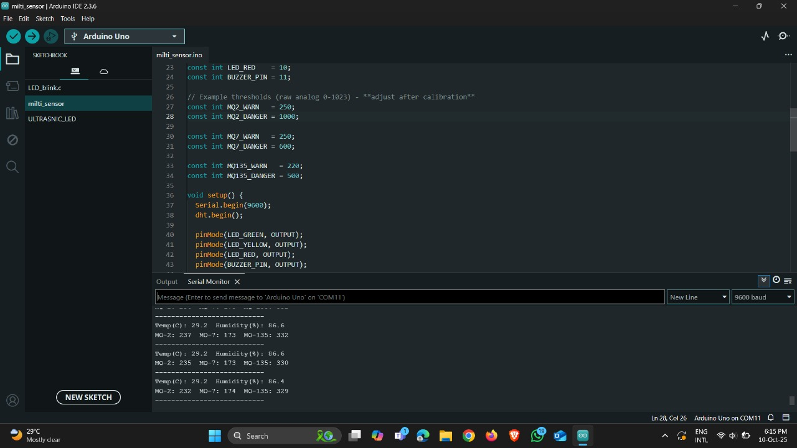

# IoT-Based Multi-Parameter Safety Device for Mining Environments
An IoT-based multi-parameter mining safety monitoring system using Arduino.

## Overview
Mining environments are inherently hazardous due to the presence of toxic gases, oxygen deficiency, extreme temperatures, and sudden health emergencies. Continuous monitoring of environmental and physiological parameters is essential to ensure miner safety. 

This project presents an IoT-based multi-parameter safety device that integrates multiple sensors with an Arduino microcontroller to monitor critical safety parameters in real time and trigger alerts when unsafe conditions are detected.

## Problem Statement
Underground mining environments pose significant safety risks due to gas leakage, low oxygen levels, high temperature, and lack of real-time health monitoring systems. Existing methods often rely on periodic manual checks rather than continuous monitoring.

## Proposed Solution
The proposed system continuously monitors environmental and physiological parameters using integrated sensors. The collected data is processed by an Arduino microcontroller, and if any parameter exceeds predefined safety thresholds, an alert is triggered to warn miners immediately.

## Features
- Oxygen level monitoring
- Harmful gas detection
- Temperature and humidity monitoring
- Heart rate monitoring
- Real-time LCD display
- Automatic buzzer alert system

## Components Used
- Arduino Uno
- MQ Gas Sensor
- Oxygen Sensor
- DHT11 Temperature & Humidity Sensor
- Pulse Sensor
- LCD Display
- Buzzer
- Power Supply Unit

## Working Principle
1. Sensors continuously collect environmental and physiological data.
2. Arduino processes the sensor inputs.
3. Threshold values are compared with real-time readings.
4. If unsafe levels are detected, the buzzer is activated.
5. All parameters are displayed on the LCD screen.

## Block Diagram
The block diagram illustrates the overall architecture of the proposed system. Multiple environmental and physiological sensors are interfaced with the Arduino microcontroller. The sensor data is continuously processed and compared against predefined safety thresholds.

If any parameter exceeds the safe limit, the system activates an alert mechanism using a buzzer. Simultaneously, real-time data is displayed on the LCD module for monitoring purposes.

This structured architecture ensures continuous monitoring, rapid response, and improved safety in mining environments.

## Prototype

The hardware prototype was developed by integrating multiple sensors with the Arduino microcontroller on a compact platform. 

The system includes gas detection sensors, temperature and humidity sensors, an oxygen monitoring unit, and a pulse sensor for physiological monitoring. All components were carefully calibrated and tested to ensure reliable real-time data acquisition.

The prototype demonstrates the feasibility of implementing a multi-parameter safety monitoring system in hazardous mining environments.

The system was tested under simulated environmental conditions to validate sensor responsiveness and alert accuracy.

## Result analysis 

The system successfully monitored environmental and physiological parameters in real time. Sensor readings were continuously displayed on the LCD module, and alert mechanisms were triggered whenever threshold limits were exceeded.

The gas sensor responded effectively to simulated gas exposure conditions. Temperature and humidity readings were stable and consistent. The pulse sensor accurately detected heart rate variations.

Overall, the prototype demonstrated reliable performance, validating the effectiveness of the proposed multi-parameter safety device.

## My Contribution
- Integrated sensors with Arduino microcontroller
- Developed threshold-based alert logic
- Performed system testing and calibration
- Assisted in documentation and system design

## Future Improvements
- Integration with cloud-based monitoring systems
- GSM module for remote alert notifications
- Data logging and analytics dashboard
- AI-based predictive hazard analysis

## Conclusion
This project demonstrates a cost-effective and scalable safety monitoring solution for mining environments. By integrating multiple sensing parameters and real-time alert mechanisms, the system enhances operational safety and reduces risk in hazardous underground conditions.

